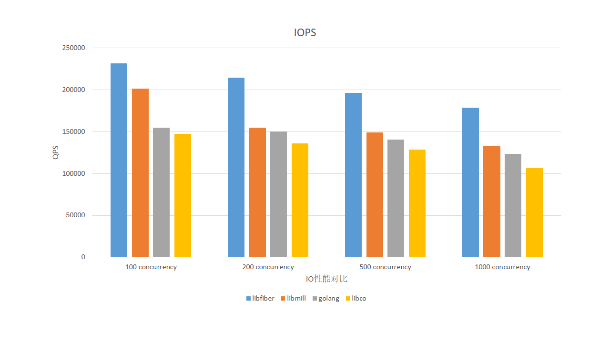

# The high performance coroutine library, supporting Linux/BSD/Windows

<!-- vim-markdown-toc GFM -->

* [About](#about)
* [Which IO events are supported?](#which-io-events-are-supported)
* [SAMPLES](#samples)
    * [One server sample](#one-server-sample)
    * [One client sample](#one-client-sample)
* [BUILDING](#building)
* [Benchmark](#benchmark)
* [API support](#api-support)
    * [Base API](#base-api)
    * [IO API](#io-api)
    * [Net API](#net-api)
    * [Channel API](#channel-api)
    * [Sync API](#sync-api)

<!-- vim-markdown-toc -->

## About
The libfiber project comes from the coroutine module of the [acl project](#https://github.com/acl-dev/acl) in lib_fiber directory of which. It can be used on OS platfroms including Linux, FreeBSD, and Windows, which supports select, poll, epoll, kqueue, iocp, and even Windows GUI messages for different platfrom. With libfiber, you can write network application services having the high performance and large cocurrent more easily than the traditional asynchronus  framework with event-driven model. <b>What's more</b>, with the help of libfiber, you can even write network module of the Windows GUI application written by MFC, wtl or other GUI framework on Windows in coroutine way. That's realy amazing.

## Which IO events are supported ?
The libfiber supports many events including select/poll/epoll/kqueue/iocp, and Windows GUI messages.

Event|Linux|BSD|Windows
----------|------|---|---
<b>select</b>|yes|yes|yes
<b>poll</b>|yes|yes|yes
<b>epoll</b>|yes|no|no
<b>kqueue</b>|no|yes|no
<b>iocp</b>|no|no|yes
<b>Win GUI message</b>|no|no|yes

## SAMPLES

### One server sample
```C
// fiber_server.c

#include <stdio.h>
#include <stdlib.h>
#include <assert.h>
#include "fiber/lib_fiber.h"
#include "patch.h" // in the samples path

static size_t      __stack_size  = 128000;
static const char *__listen_ip   = "127.0.0.1";
static int         __listen_port = 9001;

static void fiber_client(ACL_FIBER *fb, void *ctx)
{
	SOCKET *pfd = (SOCKET *) ctx;
	char buf[8192];

	while (1) {
		int ret = acl_fiber_recv(*pfd, buf, sizeof(buf), 0);
		if (ret == 0) {
			break;
		} else if (ret < 0) {
			if (acl_fiber_last_error() == FIBER_EINTR) {
				continue;
			}
			break;
		}
		if (acl_fiber_send(*pfd, buf, ret, 0) < 0) {
			break;
		}
	}

	socket_close(*pfd);
	free(pfd);
}

static void fiber_accept(ACL_FIBER *fb, void *ctx)
{
	const char *addr = (const char *) ctx;
	SOCKET lfd = socket_listen(__listen_ip, __listen_port);

	assert(lfd >= 0);

	for (;;) {
		SOCKET *pfd, cfd = socket_accept(lfd);
		if (cfd == INVALID_SOCKET) {
			printf("accept error %s\r\n", acl_fiber_last_serror());
			break;
		}
		pfd = (SOCKET *) malloc(sizeof(SOCKET));
		*pfd = cfd;
		acl_fiber_create(fiber_client, pfd, __stack_size);
	}

	socket_close(lfd);
	exit (1);
}

// FIBER_EVENT_KERNEL represents the event type on
// Linux(epoll), BSD(kqueue), Windows(iocp)
// FIBER_EVENT_POLL: poll on Linux/BSD/Windows
// FIBER_EVENT_SELECT: select on Linux/BSD/Windows
// FIBER_EVENT_WMSG: Win GUI message on Windows
// acl_fiber_create/acl_fiber_schedule_with are in `lib_fiber.h`.
// socket_listen/socket_accept/socket_close are in patch.c of the samples path.

int main(void)
{
	int event_mode = FIBER_EVENT_KERNEL;

#if defined(_WIN32) || defined(_WIN64)
	socket_init();
#endif

	acl_fiber_create(fiber_accept, NULL, __stack_size);
	acl_fiber_schedule_with(event_mode);

#if defined(_WIN32) || defined(_WIN64)
	socket_end();
#endif

	return 0;
}
```

### One client sample

```C
// fiber_client.c

#include <stdio.h>
#include <stdlib.h>
#include <string.h>
#include <assert.h>
#include "fiber/lib_fiber.h"
#include "patch.h" // in the samples path

static const char *__server_ip   = "127.0.0.1";
static int         __server_port = 9001;

// socket_init/socket_end/socket_connect/socket_close are in patch.c of the samples path

static void fiber_client(ACL_FIBER *fb, void *ctx)
{
	SOCKET cfd = socket_connect(__server_ip, __server_port);
	const char *s = "hello world\r\n";
	char buf[8192];
	int i, ret;

	if (cfd == INVALID_SOCKET) {
		return;
	}

	for (i = 0; i < 1024; i++) {
		if (acl_fiber_send(cfd, s, strlen(s), 0) <= 0) {
			printf("send error %s\r\n", acl_fiber_last_serror());
			break;
		}
		ret = acl_fiber_recv(cfd, buf, sizeof(buf), 0);
		if (ret <= 0) {
			break;
		}
	}

	acl_fiber_close(cfd);
}

int main(void)
{
	int event_mode = FIBER_EVENT_KERNEL;
	size_t stack_size = 128000;

	int i;

#if defined(_WIN32) || defined(_WIN64)
	socket_init();
#endif

	for (i = 0; i < 100; i++) {
		acl_fiber_create(fiber_client, NULL, stack_size);
	}

	acl_fiber_schedule_with(event_mode);

#if defined(_WIN32) || defined(_WIN64)
	socket_end();
#endif

	return 0;
}
```

## BUILDING
```
fiber_server: fiber_server.c
	gcc -o fiber_server fiber_server.c patch.c -I{path_of_fiber_header} -L{path_of_fiber_lib) -lfiber -ldl -lpthread

fiber_client: fiber_client.c
	gcc -o fiber_client fiber_client.c patch.c -I{path_of_fiber_header} -L{path_of_fiber_lib) -lfiber -ldl -lpthread
```

## Benchmark
The picture below show the IOPS (io echo per-second) benchmark written by libfiber, comparing with the samples writen by libmill, golang and libco. The samples written by libmill and libco are in [directory](https://github.com/acl-dev/libfiber/tree/master/benchmark), the sample written by golang is in [here](https://github.com/acl-dev/acl/tree/master/golang/src/echo), and the sample written by libfiber is in samples/server directory. The testing client is in [here](https://github.com/acl-dev/acl/tree/master/lib_fiber/samples/client2) from the [acl project](https://github.com/acl-dev/acl/).



## API support  

### Base API  
acl_fiber_create  
acl_fiber_self  
acl_fiber_status  
acl_fiber_kill   
acl_fiber_killed  
acl_fiber_signal  
acl_fiber_yield  
acl_fiber_ready  
acl_fiber_switch  
acl_fiber_schedule_init  
acl_fiber_schedule  
acl_fiber_schedule_with  
acl_fiber_scheduled  
acl_fiber_schedule_stop  
acl_fiber_set_specific  
acl_fiber_get_specific  
acl_fiber_delay  
acl_fiber_last_error  
acl_fiber_last_serror  

### IO API
acl_fiber_recv  
acl_fiber_recvfrom  
acl_fiber_read  
acl_fiber_readv  
acl_fiber_recvmsg  
acl_fiber_write  
acl_fiber_writev  
acl_fiber_send  
acl_fiber_sendto  
acl_fiber_sendmsg  
acl_fiber_select  
acl_fiber_poll  
acl_fiber_close  

### Net API
acl_fiber_socket  
acl_fiber_listen  
acl_fiber_accept  
acl_fiber_connect  

### Channel API  
acl_channel_create  
acl_channel_free  
acl_channel_send  
acl_channel_send_nb  
acl_channel_recv  
acl_channel_recv_nb  
acl_channel_sendp  
acl_channel_recvp  
acl_channel_sendp_nb  
acl_channel_recvp_nb  
acl_channel_sendul  
acl_channel_recvul  
acl_channel_sendul_nb  
acl_channel_recvul_nb  

### Sync API
<b>ACL_FIBER_MUTEX</b>  
acl_fiber_mutex_create  
acl_fiber_mutex_free  
acl_fiber_mutex_lock  
acl_fiber_mutex_trylock  
acl_fiber_mutex_unlock  

<b>ACL_FIBER_RWLOCK</b>  
acl_fiber_rwlock_create  
acl_fiber_rwlock_free  
acl_fiber_rwlock_rlock  
acl_fiber_rwlock_tryrlock  
acl_fiber_rwlock_wlock  
acl_fiber_rwlock_trywlock  
acl_fiber_rwlock_runlock  
acl_fiber_rwlock_wunlock  

<b>ACL_FIBER_EVENT</b>  
acl_fiber_event_create  
acl_fiber_event_free  
acl_fiber_event_wait  
acl_fiber_event_trywait  
acl_fiber_event_notify  

<b>ACL_FIBER_SEM</b>  
acl_fiber_sem_create  
acl_fiber_sem_free  
acl_fiber_sem_wait  
acl_fiber_sem_trywait  
acl_fiber_sem_post  
acl_fiber_sem_num  
